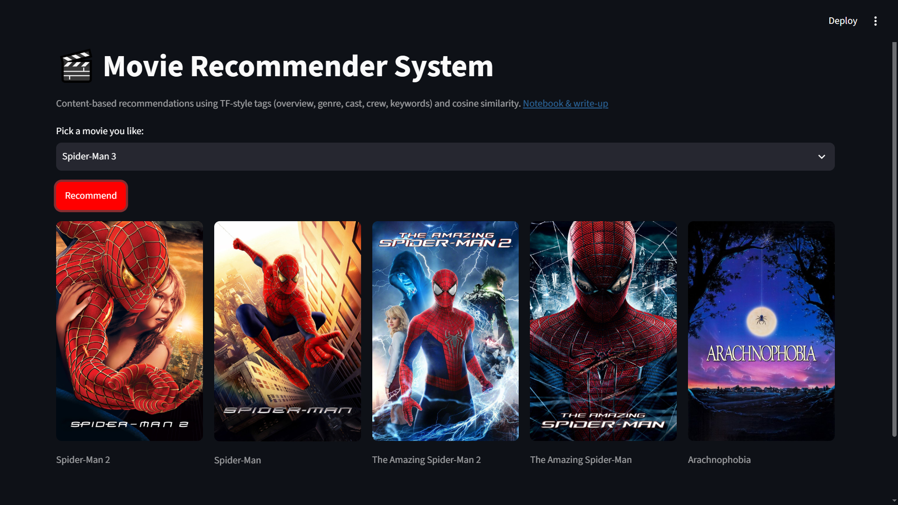

# 🎬 Content-Based Movie Recommender System

A movie recommendation engine that suggests similar titles using only movie
**metadata** (plot overview, genre, cast, crew, keywords) — no user ratings
required. Built on the [TMDB 5000 Movie Dataset](https://www.kaggle.com/datasets/tmdb/tmdb-movie-metadata),
served through a Streamlit web app.

**Live demo not present** · **Notebook (Kaggle):** [https://www.kaggle.com/code/mohammadjc/movie-recommendation/edit] · **Notebook (repo copy):** [`notebooks/movie_recommendation.ipynb`](notebooks/movie_recommendaion.ipynb)



## Why content-based (not collaborative filtering)?

Collaborative filtering needs a dense user-rating history and fails on new or
niche movies (the "cold-start" problem). A content-based approach works from
day one for any movie with metadata, at the cost of being less personalized
to an individual user's taste. This project deliberately trades personalization
for robustness and simplicity — a reasonable choice to explain in an interview
or SOP.

## How it works

1. **Merge** TMDB's movie and credits datasets on title.
2. **Engineer a `tag` field** per movie: overview + genres + keywords + top-3
   cast + director, normalized (lowercased, stemmed, multi-word names joined
   into single tokens).
3. **Vectorize** tags with `CountVectorizer` (bag-of-words, 5000 features).
4. **Compute cosine similarity** between every pair of movie vectors.
5. Given a movie, **return the 5 nearest neighbors** by similarity score.

Full pipeline with commentary: [`notebooks/movie_recommendation.ipynb`](notebooks/movie_recommendation_eda.ipynb).

## Project structure

```
movie-recommender-system/
├── app.py                          # Streamlit application
├── requirements.txt
├── .gitignore
├── .streamlit/
│   └── secrets.toml.example        # Template for TMDB API key 
├── data/
│   ├── movie_dict.pkl              # Movie metadata (generated by the notebook)
│   └── similarity.pkl              # Precomputed similarity matrix (generated by the notebook)
├── notebooks/
│   └── movie_recommendation.ipynb # Full data pipeline, commented cell-by-cell
├── docs/
│   └── screenshot.png
├── EXPERIMENT_LOG.md                # Design decisions and what was tried/rejected
├── LICENSE
└── README.md
```

## Getting started

### Prerequisites
- Python 3.10+
- A free [TMDB API key](https://www.themoviedb.org/settings/api)

### Setup
```bash
git clone https://github.com/Mohammad-Idrees-jc/movie-recommender-system.git
cd movie-recommender-system
pip install -r requirements.txt

cp .streamlit/secrets.toml.example .streamlit/secrets.toml
# then edit .streamlit/secrets.toml and paste your real TMDB API key
```

### Regenerate the data artifacts
`data/*.pkl` files aren't committed to source control (see note below). Run
the notebook once to generate them:
```bash
jupyter nbconvert --to notebook --execute notebooks/movie_recommendation.ipynb
# then move the generated movie_dict.pkl and similarity.pkl into data/
```

### Run the app
```bash
streamlit run app.py
```

## A note on the similarity matrix's size

For ~4800 movies, the full pairwise cosine similarity matrix is roughly
4800×4800 floats. Even after casting to `float32` this can approach GitHub's
100MB single-file limit, so it's excluded via `.gitignore` rather than
committed. Three options if you want it in version control anyway:
- **Git LFS** for the `.pkl` files.
- **Regenerate on deploy** (Streamlit Community Cloud can run a setup step).
- **Host the pickles externally** (e.g. a release asset or cloud storage) and download them at app startup.

## Deployment

This app is set up to deploy directly on
[Streamlit Community Cloud](https://streamlit.io/cloud):
1. Push this repo to GitHub.
2. On Streamlit Cloud, "New app" → point at this repo → `app.py`.
3. Under **App settings → Secrets**, paste the contents of your
   `secrets.toml` (with your real API key).

## Possible improvements

See [`EXPERIMENT_LOG.md`](EXPERIMENT_LOG.md) for what was tried, what worked,
and what's next (TF-IDF weighting, hybrid popularity signal, quantitative
evaluation via precision@k).

## Dataset & attribution

- [TMDB 5000 Movie Dataset](https://www.kaggle.com/datasets/tmdb/tmdb-movie-metadata) (Kaggle, CC BY-NC-SA)
- Poster images and live metadata via [The Movie Database (TMDB) API](https://www.themoviedb.org/documentation/api). This product uses the TMDB API but is not endorsed or certified by TMDB.

## License

MIT — see [LICENSE](LICENSE).

## Author

**Mohammad Idrees** — BS Computer Science, Government Post Graduate
Jahanzeb College, Saidu Sharif Swat (affiliated with University of Swat)
[https://www.linkedin.com/in/mohammad-idrees-5029b531a/](#) · [https://github.com/Mohammad-Idrees-jc](#) · [Mohammadidreesjc@gmail.com](#)
